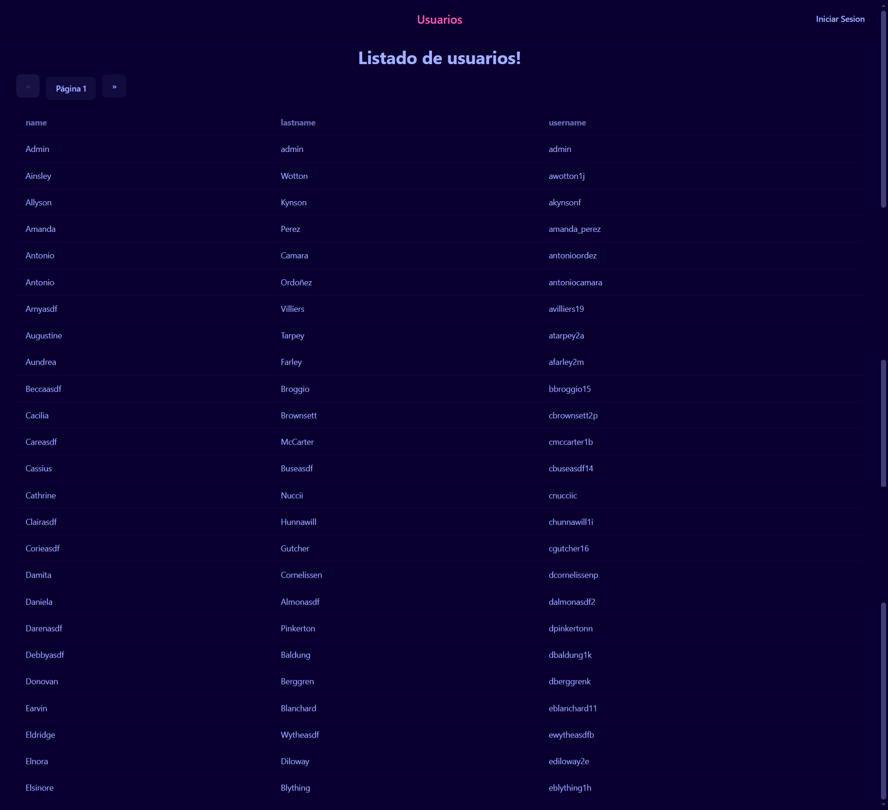
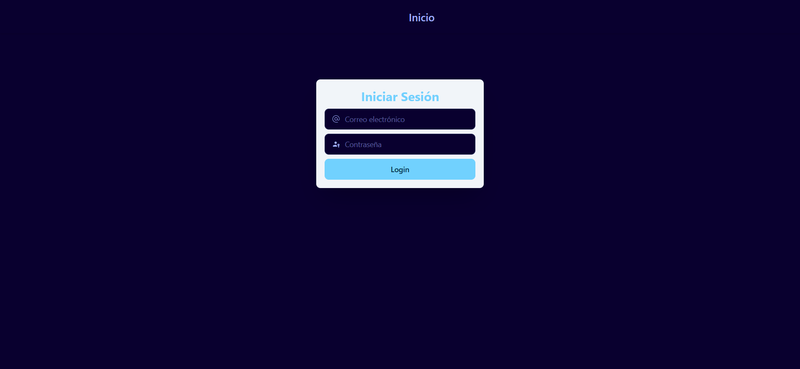
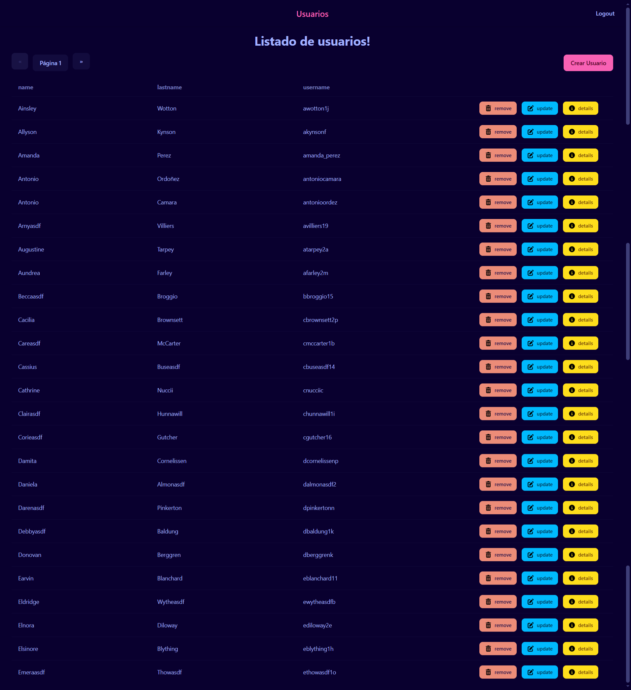
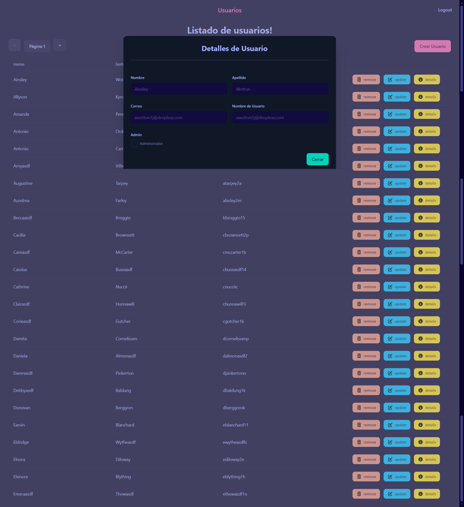
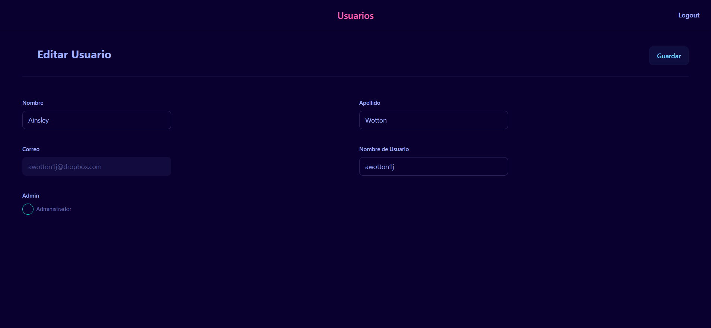

# UserAppFront

<p align="center">
  &nbsp;
  
  

</p>

**UserAppFront** crud de usuarios asi como roles y autenticación con jwt **Tailwind CSS** y **daisyUI**.

## Run Locally

Clone the project

```bash
  git clone https://https://github.com/miguel-camara/user-app-front.git
```

Go to the project directory

```bash
  cd user-app-front
```

Install dependencies

```bash
  npm install
```

Start the server

```bash
  npm run start
```

## Environment Variables

To run this project, you will need to add the following environment variables to your **environment.ts** files

`baseUrl`

## Demo

[Demo](http://user-app-angular.s3-website.us-east-2.amazonaws.com/#/users)

## Screenshots











## Features

- **User App Front:** Aplicación full stack usando Angular para el front, en esta manejamos protección de rutas usando guard, para el back usamos spring boot, usando spring security para la autenticación y spring JPA para la persistencia de datos.

## Tech Stack

**Frontend:** Angular, Tailwind CSS y daisyUI
